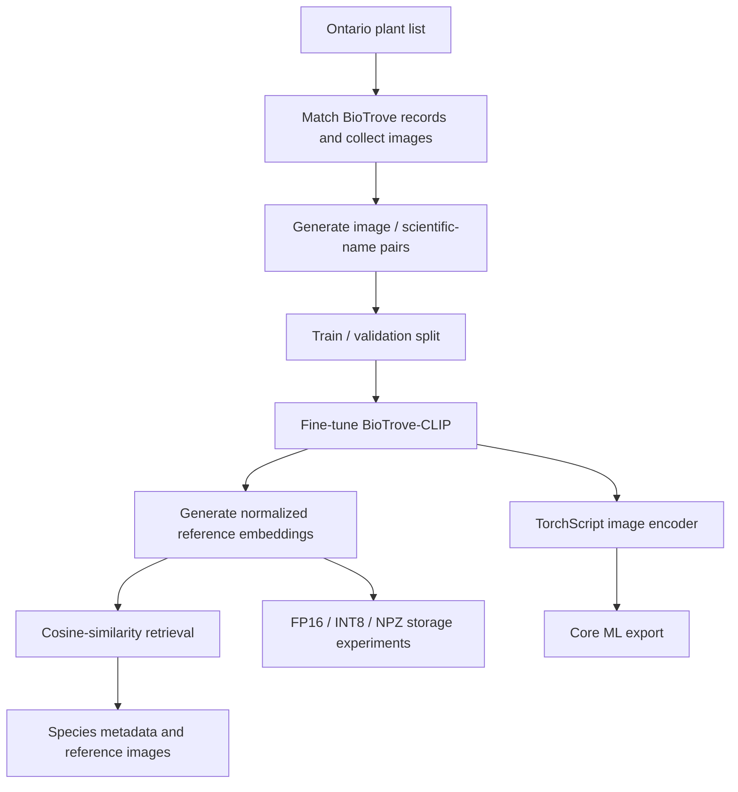

# PlantDexter v2

An offline plant-identification prototype built around BioTrove-CLIP, an Ontario-focused dataset, and a mobile deployment pipeline targeting iOS.

I started PlantDexter as a learning project after wanting a nature guidebook that could work while backcountry camping without a network connection. The project took me through regional dataset construction, fine-tuning a pretrained vision-language model, embedding-based retrieval, storage optimization, and preparing the model for on-device inference.

This repository contains the Python training, retrieval, and deployment-preparation pipeline. The v2 prototype reached TorchScript/Core ML export and offline asset packaging, but was not completed as a production iPhone application.

## What I worked on

* Built an Ontario-focused dataset by matching vascular-plant records against BioTrove metadata and supplementing underrepresented species with iNaturalist imagery.
* Fine-tuned **BGLab/BioTrove-CLIP** using PyTorch, OpenCLIP, AdamW, and Apple Metal/MPS acceleration.
* Generated normalized image and text embeddings for cosine-similarity retrieval.
* Optimized embedding generation using batching, autocast, and parallel data loading.
* Prepared the fine-tuned image encoder for deployment through **TorchScript → Core ML**, targeting iOS 16.
* Explored **FP16, INT8, and compressed NPZ** representations to reduce the storage footprint of the offline embedding database.
* Built supporting metadata and reference-image pipelines for local plant lookup.

BioTrove provides the pretrained model and primary source dataset. My work focused on regional data preparation, fine-tuning, embedding generation, retrieval, optimization, and deployment experiments.

## Pipeline



The intended offline workflow is:

1. Encode a new plant photograph on-device.
2. Compare its normalized feature vector against stored reference embeddings.
3. Retrieve the closest matching species.
4. Display locally stored species information and reference imagery.

## Dataset

The working dataset covered approximately **2,355 plant classes**, with at least 100 images available for all but 21 classes.

The original goal was Ontario native-plant identification. The final experimental dataset was somewhat broader because the native-only condition in the preprocessing filter was disabled, so it is described here as **Ontario-focused** rather than strictly native-only.

Image/text pairs use simple scientific-name prompts such as:

```text
a photo of Acer rubrum
```

The cleaned pipeline preserves explicit scientific-name and source-image metadata alongside every generated embedding row.

## Embedding generation

Reference embeddings are generated in batches using the fine-tuned BioTrove-CLIP model and normalized for cosine-similarity retrieval.

The initial embedding-generation workflow was projected to take roughly **10 hours**. After introducing batching, autocast, and parallel data loading, the recorded runtime was approximately **3.5 hours**.

The 10-hour figure was an early projection rather than a measured baseline, so this should be treated as a historical development observation rather than a formal benchmark.

## Mobile storage experiments

Offline deployment made storage one of the main engineering constraints.

Approximate artifact sizes recorded during development were:

| Artifact                            | Recorded size |
| ----------------------------------- | ------------: |
| Compressed FP16 embeddings (`.npz`) |        370 MB |
| INT8 embeddings (`.pt`)             |        400 MB |
| Core ML model                       |        170 MB |
| Compressed reference images         |         70 MB |
| Text and metadata                   |         20 MB |

These are historical file-size observations rather than reproduced benchmarks. No final installed application size, phone memory usage, or on-device latency measurements were preserved.

The main tradeoff was between retaining embedding precision and reducing the storage footprint enough for a fully offline mobile application.

## iOS deployment preparation

The image encoder can be exported through:

```text
fine-tuned BioTrove-CLIP
        ↓
TorchScript
        ↓
Core ML
```

The Core ML interface expects a preprocessed float32 tensor with shape:

```text
[1, 3, 224, 224]
```

Inference preprocessing is kept consistent with OpenCLIP's validation transform. The repository includes a reference preprocessing helper and records the preprocessing configuration alongside the exported model.

The consuming iOS application would still need to reproduce that preprocessing and implement retrieval against the stored embedding database.

## Repository layout

```text
preprocessing/     Species filtering, image collection, counts, and data splitting
modeling/          Fine-tuning, embedding generation, evaluation, and metadata
deployment/ios/    TorchScript/Core ML export and storage experiments
docs/              Pipeline details and original development notes
```

Useful entry points:

* [`modeling/biotrove_fine_tune_sc.py`](modeling/biotrove_fine_tune_sc.py) — BioTrove-CLIP fine-tuning
* [`modeling/create_embeddings.py`](modeling/create_embeddings.py) — batched reference embedding generation
* [`deployment/ios/convert_to_torchscript.py`](deployment/ios/convert_to_torchscript.py) — fine-tuned encoder export
* [`deployment/ios/convert_ts_to_coreml.py`](deployment/ios/convert_ts_to_coreml.py) — Core ML conversion
* [`docs/pipeline.md`](docs/pipeline.md) — detailed data flow, inputs, outputs, and deployment requirements

## Reproducing the project

The original image dataset, trained checkpoints, generated embeddings, and Core ML artifacts are intentionally not committed to the repository.

The scripts use:

* PyTorch
* OpenCLIP (`open_clip_torch`)
* torchvision
* pandas
* NumPy
* Pillow
* Hugging Face Datasets
* scikit-learn
* `coremltools` for Core ML conversion

The original package versions were not preserved, so the repository should be treated as a historical prototype rather than a fully reproducible packaged release.

See [`docs/pipeline.md`](docs/pipeline.md) for the expected inputs, script order, artifact paths, and remaining validation work.

## Limitations

This project was primarily a learning and deployment prototype.

Informal identification tests looked promising, but no trustworthy numerical accuracy results are preserved, and no claims are made here about final classification accuracy.

The repository also does not contain:

* a completed Swift/Xcode application
* measured iPhone inference latency
* measured iPhone memory usage
* a validated end-to-end mobile deployment

These would be the next steps before treating the project as a production-quality identification system.

## Sources

* [BioTrove project](https://baskargroup.github.io/BioTrove/)
* [BioTrove-CLIP model](https://huggingface.co/BGLab/BioTrove-CLIP)
* [BioTrove dataset](https://huggingface.co/datasets/BGLab/BioTrove)
* [Ontario Natural Heritage Information Centre](https://www.ontario.ca/page/get-natural-heritage-information)
* [iNaturalist](https://www.inaturalist.org/)
* [Wikipedia](https://en.wikipedia.org/)
* [Wikimedia Commons](https://commons.wikimedia.org/)

The original sequence of experiments, rough measurements, and development notes is preserved in [`docs/development-notes.md`](docs/development-notes.md).
