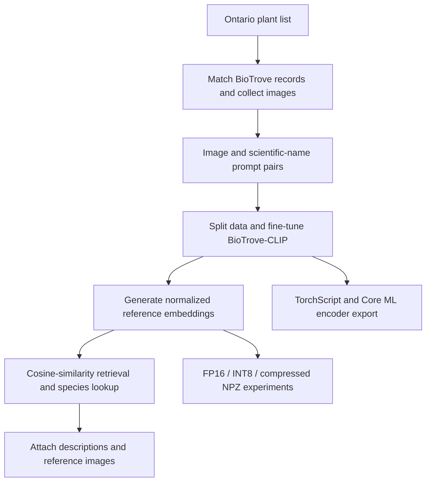

# PlantDexter v2

An offline plant-identification prototype built with BioTrove-CLIP and an Ontario-focused dataset, prepared for iOS deployment.

I wanted a nature guidebook I could use while backcountry camping without a connection. PlantDexter v2 was a learning project that took me through building a regional dataset, fine-tuning a pretrained model, and reducing the footprint of the model and reference data for a phone.

This repository contains the Python training and deployment-preparation work. An earlier PlantDexter capstone achieved offline phone inference; this later BioTrove-based v2 reached model export and asset packaging. Its iPhone runtime was not validated here, and no Swift/Xcode application is included.

## Pipeline



The Python experiments compare normalized image and text vectors using cosine similarity. The intended mobile flow encodes a new photo, searches stored reference vectors, and looks up the plant information locally.

## Dataset and fine-tuning

The dataset covered approximately **2,355 plant classes**, with at least 100 images for all but 21 classes. I matched an Ontario vascular-plant list against BioTrove metadata and used additional iNaturalist downloads for underrepresented classes. The original goal was native-plant identification; the checked-in species filter is broader because its native-only condition is disabled.

I fine-tuned **BGLab/BioTrove-CLIP through OpenCLIP**, optimizing the full model with AdamW. The configuration uses batch size 16, two epochs, learning rate `5e-6`, and Apple Metal/MPS acceleration where available. The development notes record a fine-tuning run of approximately **12.5 hours**.

The original prototype trained on the complete pairs CSV. The cleaned pipeline now trains from `train_pairs.csv` and evaluates on `val_pairs.csv`. This correction applies to new runs; it does not make historical checkpoints held-out evaluations.

## Embeddings and retrieval

Reference generation uses batches, autocast, and CPU data-loader workers. Its initial runtime estimate was roughly **10 hours**; the optimized workflow took approximately **3.5 hours**. The initial figure was a projection, so these notes do not establish a measured speedup ratio.

The output includes normalized image/text embedding matrices, species metadata, and a JSONL mapping from every embedding row to its scientific name and source image. Repeated species and skipped images retain explicit row identities. Embedding generation and inference use OpenCLIP's deterministic validation transform; training retains its original training transform.

## Mobile storage experiments

I compared FP16, INT8, and compressed FP16 NPZ representations while preparing reference information for offline use. Approximate sizes recorded during development were:

| Artifact | Historical size |
| --- | ---: |
| Core ML model | 170 MB |
| Reference images | 70 MB |
| Metadata JSON | 20 MB |
| INT8 embeddings | 400 MB |
| Compressed FP16 NPZ embeddings | 370 MB |

These are historical observations, not reproduced benchmarks. Intermediate FP16 tensor-file measurements were inconsistent. There is no recorded final installed application size or measured iPhone RAM use; archive size alone does not establish runtime memory use.

## iOS deployment status

The export path extracts the fine-tuned visual encoder, traces it with TorchScript, and converts it to a Core ML model with FP16 compute precision targeting iOS 16. The checkpoint-loading omission in the original export script has been corrected.

The cleaned Core ML interface accepts a **preprocessed float32 tensor of shape `[1, 3, 224, 224]`**. Resize, crop, RGB conversion, and normalization remain outside the model. A [reference helper](deployment/ios/preprocess_image.py) uses OpenCLIP's own inference transform, and export saves the preprocessing specification beside the traced model. The consuming iOS application must reproduce it. Conversion and device output agreement still need validation with the original artifacts.

## Repository structure

```text
preprocessing/     Species filtering, image collection, counts, and splitting
modeling/          Fine-tuning, embeddings, retrieval experiments, and metadata
deployment/ios/    TorchScript/Core ML export, input preparation, and compression
docs/             Pipeline guide and original development notes
```

## Reproducing the pipeline

This historical prototype has been cleaned for readability and reproducibility, but the original datasets, checkpoints, embeddings, and mobile artifacts are intentionally absent. The original environment versions were not preserved.

Start with the [pipeline guide](docs/pipeline.md) for dependencies, inputs, script order, checkpoint selection, and the exact deployment preprocessing. Scripts run from the repository root, using `data/`, `embeddings/`, `checkpoints/`, and `artifacts/ios/`. The image directory can be set with `PLANTDEXTER_IMAGE_ROOT`; remaining path settings are near the top of each script, and the export tools accept CLI paths.

## Limitations

Informal identification tests looked promising, but no trustworthy numerical accuracy results are preserved. The evaluator still measures image-text row retrieval and needs methodology review before reporting species-classification accuracy. The random split also does not establish independence between duplicate images or related observations.

This is a deployment-preparation prototype, with no measured iPhone latency, validated end-to-end v2 application, or new performance results from this cleanup.

## Sources and history

BioTrove supplies the pretrained model and primary image metadata; my work here is the regional dataset, fine-tuning, embedding pipeline, and mobile deployment experiments.

- [BioTrove project](https://baskargroup.github.io/BioTrove/), [model](https://huggingface.co/BGLab/BioTrove-CLIP), and [dataset](https://huggingface.co/datasets/BGLab/BioTrove)
- [Ontario Natural Heritage Information Centre](https://www.ontario.ca/page/get-natural-heritage-information)
- [iNaturalist](https://www.inaturalist.org/), [Wikipedia](https://en.wikipedia.org/), and [Wikimedia Commons](https://commons.wikimedia.org/) for additional images and reference information

The [original development notes](docs/development-notes.md) preserve the experiments, rough measurements, and tool-use acknowledgements. They include historical plans and estimates; use this README for the current status.
